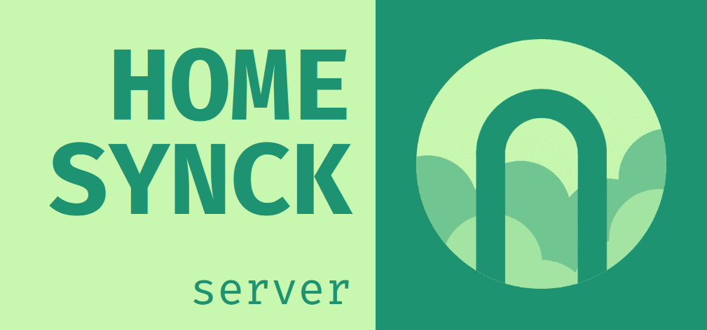

# Homesynck server

**Table of contents**
- [What is Homesynck server?](#what-is-homesynck-server)
- [What is real-time order-sensitive data synchronization?](#what-is-real-time-order-sensitive-data-synchronization)
- [How does it work?](#how-does-it-work)

**Useful links:**
- [Self-hosting guide](./docs/self_host_guide.md)
- [Check out existing SDKs](https://homesynck.anicetnougaret.fr/)
- [Make your hown client SDK guide](docs/channels_docs.md)

## What is Homesynck server? 
It's a real-time order-sensitive data synchronization tool.

Its main goals are scalability, reliability and security so that it fits most use cases.

It is free and open-source under MIT license. It can be self-hosted easily.

## What is real-time order-sensitive data synchronization?
Basically, when you're sending data from multiple places at the same time but you want to achieve synchronization. Which requires you to have data received and processed in the same order by everyone.

The challenge is that order is not garanteed when things are done remotely and concurrently, Homesynck server tries to enforce its own order so that Homesynck clients can agree on it.

Ordering problems can be critical when writing software. Here are some concrete examples:

- Remote file synchronization
- Collaborative apps (e.g. Google Docs clones)
- Order-sensitive message exchanging (e.g. messaging apps)
- Turn-based video games

## How does it work?
Clients send messages to directories hosted on a Homesynck server. Homesynck takes note of the order in which it received messages for each directory. Then it sends the messages back to clients and indicates to them in which order messages should be processed. At the end, clients connected on a same directory are garanteed to have received the same messages in the same order.

Clients also declare which updates they received on connection and the server fills the gaps *(Client SDKs are still heavily work in progress and don't always patch "holes" within their received updates list. Although they all support receiving new updates forward)*.

Official clients, called SDKs, are available and can be imported into most pieces of software.